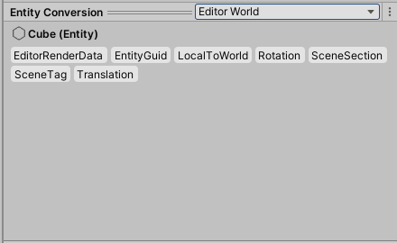
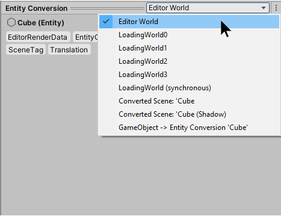
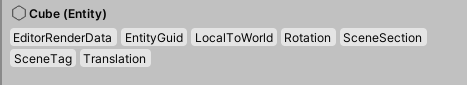

# Entity Conversion Preview Window

Installing the DOTS Editor package gives you access to the Entity Conversion Preview Window.

The Entity Conversion Preview Window allows you to examine the way that your GameObjects and their "classic" Components are converted to ECS Entities and Components.

It becomes visible when you use the Inspector Window to view GameObjects within SubScenes that are set up to be converted to Entities.

You can use the Entity Conversion Preview Window to check that your GameObjects are being converted to Entities and ECS components in the way that you expect. You can check that desired ECS components are present, and that undesired ones are not. You inspect the data values of each component, which can help when debugging your project.

## The World dropdown menu

The title bar of the Entity Conversion Preview Window displays a dropdown menu which you can use to select the World to preview.

The World dropdown menu shows a list of all the existing worlds.

Some world types are not useful in the normal course of development, but are listed nonetheless.

* **Editor World / Default World** - This is the "live" world, where the main simulation happens. While outside of Play mode, this world is named “Editor World”; in Play mode, it is called “Default World”.

* **LoadingWorld[x]** - These are worlds that exist for streaming new content. They are first loaded in these worlds and then copied in the Editor/Default world. This is not *usually* useful for typical ECS development.

* **Converted Scene: _GameObject name_** - These types of world contain the result of the conversion of a sub-scene. This is considered a read-only world after conversion is completed. After conversion, the entities are copied back in the Editor/Default world.

* **Converted Scene: _GameObject name_ (Shadow)** - This type of world exists to be able to calculate the difference between conversions. This is not useful for development.

* **GameObject -> Entity Conversion ‘_GameObject name_’** - This is the "GameObject conversion world", where the conversion actually happens. This is not useful for development.

## The component list

The component list section displays all the ECS components that belong to the currently selected entity.

You can click on each of the components listed here to show the data associated with each component. You can select multiple components using the Ctrl or Shift keys to display the data of multiple components at the same time.

Sometimes components have a suffix added to their name, which distinguishes between different types of component.

* **[B]** indicates the component is a buffer component

* **[S]** indicates exclusion of components (for example, when performing queries)

* **[RO]** indicates the component is read-only

The values shown for components in the preview window sometimes differ from those in their corresponding "classic" components. An example of this is the rotation values, which are shown in degrees in the main inspector, but in radians in the preview window.

