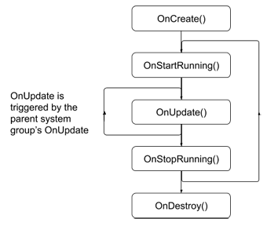

## Creating a system

Implement the abstract class [SystemBase] to create an ECS system.

To create a system, you program the necessary system event callbacks. 
Use the [SystemBase OnUpdate()][OnUpdate()] function to perform the work your system must do every frame. The other callback functions are optional; for example, you can use [OnCreate()] to initialize a system, but not every system requires initialization code.

The system callback functions are invoked in the following order:

* [OnCreate()] -- called when the system is created.
* [OnStartRunning()] -- before the first [OnUpdate()] and whenever the system resumes running.
* [OnUpdate()] -- every frame as long as the system has work to do (see [ShouldRunSystem()]) and the system is [Enabled].
* [OnStopRunning()] -- whenever the system stops updating, which can be because you set [Enabled] to false or because it finds no entities matching its queries. Also called before [OnDestroy()].
* [OnDestroy()] -- when the system is destroyed.

A system's [OnUpdate()] function is triggered by its parent [system group's] own [OnUpdate()] function. Likewise, when a group changes state, for example if you set the group's [Enabled] property, it changes the state of its child systems. However, children can also change state independently from their parent groups. See [System update order] for more information.
 
All the system events run on the main thread. Ideally, your [OnUpdate()] function schedules jobs to perform most of the work. To schedule a job from a system, you can use one of the following mechanisms:

* [Entities.ForEach] -- the simplest way to iterate over ECS component data.
* [Job.WithCode] -- execute a lambda function as a single, background job.
* [IJobChunk] -- a "lower level" mechanism for iterating over ECS component data chunk-by-chunk.
* [C# Job System] -- create and schedule general purpose C# jobs.

The following example illustrates using [Entities.ForEach] to implement a system that updates one component based on the value of another:
 
[!code-cs[basic-system](../package/DocCodeSamples.Tests/SystemBaseExamples.cs#basic-system)]

[ComponentSystemGroup]: xref:ecs-system-update-order
[Entities.ForEach]: xref:Unity.Entities.SystemBase.Entities
[Job.WithCode]: xref:Unity.Entities.SystemBase.Job
[EntityCommandBufferSystem]: xref:ecs-entity-command-buffer
[EntityCommandBuffer]: xref:Unity.Entities.EntityCommandBuffer
[IJobChunk]: xref:Unity.Entities.IJobChunk)
[OnCreate()]: xref:Unity.Entities.ComponentSystemBase.OnCreate*
[OnDestroy()]: xref:Unity.Entities.ComponentSystemBase.OnDestroy*
[OnStartRunning()]: xref:Unity.Entities.ComponentSystemBase.OnStartRunning*
[OnStopRunning()]: xref:Unity.Entities.ComponentSystemBase.OnStopRunning*
[OnUpdate()]: xref:Unity.Entities.SystemBase.OnUpdate*
[syncronization points]: xref:sync-points
[system attributes]: system_update_order.md#attributes
[SystemBase]: xref:Unity.Entities.SystemBase
[Enabled]: xref:Unity.Entities.ComponentSystemBase.Enabled
[World]: xref:Unity.Entities.World
[GameObject conversion systems]: gp_overview.md
[time]: xref:Unity.Entities.Core.TimeData
[World]: xref:Unity.Entities.World
[UpdateWorldTimeSystem]: xref:Unity.Entities.UpdateWorldTimeSystem
[system events]: #system-events
[C# Job System]: https://docs.unity3d.com/Manual/JobSystem.html
[system group's]: system_update_order.md#groups
[system attributes]: system_update_order.md#attributes
[System update order]: system_update_order.md
[ShouldRunSystem()]: xref:Unity.Entities.ComponentSystemBase.ShouldRunSystem*

<!--Note the following links are intentionally pointing to an old version-->
[ComponentSystem]: https://docs.unity3d.com/Packages/com.unity.entities@0.5/manual/entity_iteration_foreach.html
[IJobForEach]: https://docs.unity3d.com/Packages/com.unity.entities@0.5/manual/entity_iteration_job.html
[JobComponentSystem]: https://docs.unity3d.com/Packages/com.unity.entities@0.5/manual/entities_job_foreach.html
