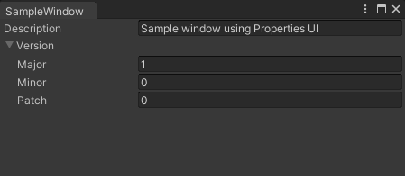
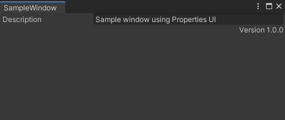
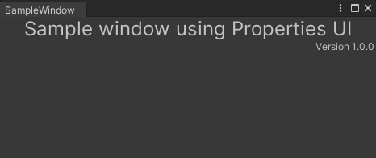
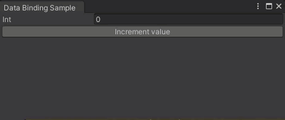
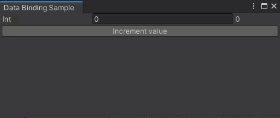
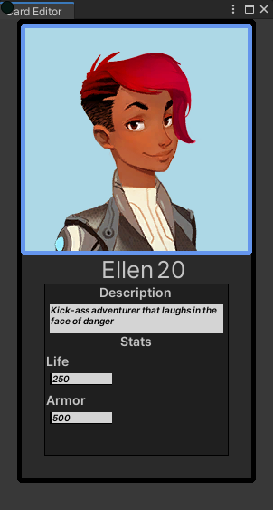

# Properties UI

The `com.unity.properties.ui` package offers utilities to generate UIElements-based visual trees from data using the `com.unity.properties` package. This API is found in the `Unity.Properties.UI.Editor` assembly (referenced automatically for convenience), under the `Unity.Properties.UI` namespace.

The main goal of this package is to allow:
* the creation of generic inspector-like visual trees,
* the creation of custom inspectors and property drawers
* data-binding
* enhanced support for collection types in the editor

This manual targets developers that intends to create custom inspectors.

# Glossary

**Custom Inspectors** are drawers based on a given type. These drawers will be used for every field of that type.

**Property Drawers** are drawers based on an attribute. Theses drawers will be used when a field is tagged with a `PropertyAttribute`. This allows to draw fields of heterogeneous types in a similar fashion.


# Getting Started

Here are short examples illustrating a basic usage of the Properties UI API.

**Creating a simple editor window**
```c#
namespace Unity.Properties.Samples
{
    using Unity.Properties.UI;
    using UnityEditor;
    using UnityEngine;

    public class SampleWindow : EditorWindow
    {
        public class WindowVersion
        {
            public int Major = 1, Minor = 0, Patch = 0;
        }

        public class WindowData
        {
            public string Description = "Sample window using Properties UI";
            public WindowVersion Version = new WindowVersion();
        }

        [MenuItem("Properties/Samples/Sample Window")]
        public static void ShowExample()
        {
            var wnd = GetWindow<SampleWindow>();
            wnd.titleContent = new GUIContent("SampleWindow");
        }

        public void OnEnable()
        {
            var propertyElement = new PropertyElement();
            propertyElement.SetTarget(new WindowData());
            rootVisualElement.Add(propertyElement);
        }
    }
}
```



**Creating a custom inspector**

```c#
namespace Unity.Properties.Samples
{
    using Unity.Properties.UI;
    using UnityEngine.UIElements;

    class WindowVersionInspector : Inspector<SampleWindow.WindowVersion>
    {
        public override VisualElement Build()
        {
            var version = Value;
            var valueLabel = new Label {text = $"Version {version.Major}.{version.Minor}.{version.Patch}"}; 
            
            valueLabel.style.alignSelf = Align.FlexEnd;
            return valueLabel;
        }
    }
}
```


**Creating a property drawer**
```c#
namespace Unity.Properties.Samples
{
    using Unity.Properties.UI;
    using UnityEngine;
    using UnityEngine.UIElements;
    
    public class CenteredLabelAttribute : PropertyAttribute
    {
        public int FontSize = 16;
    }
    
    public class CenteredLabelDrawer : PropertyDrawer<string, CenteredLabelAttribute>
    {
        public override VisualElement Build()
        {
            var attribute = DrawerAttribute;
            var label = new Label {text = Value};
            label.style.fontSize = attribute.FontSize;
            label.style.alignSelf = Align.Center;
            return label;
        }
    }
}
```

```c#
public class WindowData
{
    [CenteredLabel(FontSize = 24)]
    public string Description = "Sample window using Properties UI";
    public WindowVersion Version = new WindowVersion();
}
```


**Built-in data-binding**
```c#
namespace Unity.Properties.Samples
{
    using Unity.Properties.UI;
    using UnityEngine.UIElements;
    using UnityEditor;
    using UnityEngine;

    public class DataBindingSampleWindow : EditorWindow
    {
        public class Data
        {
            public int Int;
        }

        [CreateProperty] Data m_Data;
        
        [MenuItem("Properties/Samples/Data-binding Sample Window")]
        public static void ShowExample()
        {
            var wnd = GetWindow<DataBindingSampleWindow>();
            wnd.titleContent = new GUIContent("Data Binding Sample");
        }

        public void OnEnable()
        {
            m_Data = new Data();
            
            var propertyElement = new PropertyElement();
            propertyElement.SetTarget(m_Data);
            rootVisualElement.Add(propertyElement);
            rootVisualElement.Add(new Button(IncrementValue){ text = "Increment value"});
        }

        void IncrementValue()
        {
            m_Data.Int++;
        }
    }
}
```



**Manual data-binding**
```c#
using Unity.Properties.UI;
using UnityEditor.UIElements;
using UnityEngine.UIElements;

namespace Unity.Properties.Samples
{
    public class DataBindingInspector : Inspector<DataBindingSampleWindow.Data>
    {
        Label m_ValueAsLabel;
        
        public override VisualElement Build()
        {
            var root = new VisualElement();
            var fieldName = nameof(DataBindingSampleWindow.Data.Int);
            var integerField = new IntegerField(fieldName);
            integerField.style.flexGrow = 1;
            
            // using the binding path will automatically update the value whenever possible.
            integerField.bindingPath = fieldName;
            root.Add(integerField);
            
            // there is no automatic binding between int => label, so we will use the Update method to update the
            // text of the label to match the value.
            m_ValueAsLabel = new Label(Value.Int.ToString());
            m_ValueAsLabel.style.alignSelf = Align.Center;
            m_ValueAsLabel.style.width = 75;
            root.Add(m_ValueAsLabel);

            root.style.flexDirection = FlexDirection.Row;
            return root;
        }

        public override void Update()
        {
            m_ValueAsLabel.text = Value.Int.ToString();
        }
    }
}
```



These samples focus on code-driven workflows. It is possible to use `uxml` and `uss` files to drive the look and feel of a custom inspector or property drawer. Setting the `binding-path` attribute in `uxml` files will kick-off automatic data-binding.

**Uxml-based data-binding**

*Editor Window*
```c#
using Unity.Properties.UI;
using UnityEditor;
using UnityEngine;
using UnityEngine.UIElements;

namespace Unity.Properties.Samples
{
    public class CardEditorWindow : EditorWindow
    {
        [MenuItem("Properties/Samples/Card Editor")]
        public static void ShowExample()
        {
            var wnd = GetWindow<CardEditorWindow>();
            wnd.titleContent = new GUIContent("Card Editor");
        }

        struct CharacterInfo
        {
            public string Name;
            public float Level;
        }

        struct Stats
        {
            public float Life;
            public float Armor;
        }

        class Character
        {
            public CharacterInfo Info;
            public Texture2D Texture;
            public string Description;
            public Stats Stats;
        }

        class UICard
        {
            public Character Character;
        }

        class CharacterInspector : Inspector<UICard>
        {
            public override VisualElement Build()
            {
                var root = AssetDatabase.LoadAssetAtPath<VisualTreeAsset>("Assets/Samples/3. EditorWindow/Editor/card.uxml").Instantiate();
                var styleSheet = AssetDatabase.LoadAssetAtPath<StyleSheet>("Assets/Samples/3. EditorWindow/Editor/card.uss");
                root.styleSheets.Add(styleSheet);
                return root;
            }
        }

        public void OnEnable()
        {
            // Setup the character data.
            var character = new Character
            {
                Texture = AssetDatabase.LoadAssetAtPath<Texture2D>("Assets/Samples/3. EditorWindow/Editor/Ellen_CutscenePortrait_000.png"),
                Info = new CharacterInfo { Name = "Ellen",  Level = 20 },
                Description = "Kick-ass adventurer that laughs in the face of danger",
                Stats = new Stats { Life = 250,  Armor = 500 }
            };

            var card = new UICard {Character = character};
            var cardElement = new PropertyElement();
            cardElement.SetTarget(card);
            rootVisualElement.Add(cardElement);
        }
    }
}
```
*UXML file*
```xml
<?xml version="1.0" encoding="utf-8"?>
<engine:UXML
    xmlns:xsi="http://www.w3.org/2001/XMLSchema-instance"
    xmlns:engine="UnityEngine.UIElements"
    xmlns:editor="UnityEditor.UIElements"
    xsi:noNamespaceSchemaLocation="../../../../UIElementsSchema/UIElements.xsd"
>
    <engine:BindableElement binding-path="Character">
        <engine:VisualElement class="self-centered card-info thin-border">
            <engine:BindableElement class="card-character regular-border" binding-path="Texture"/>
            <engine:BindableElement class="row self-centered" binding-path="Info">
                <engine:Label class="big-label" binding-path="Name"/>
                <engine:Label class="big-label" binding-path="Level"/>
            </engine:BindableElement>
            <engine:VisualElement class="card-info regular-border">
                <engine:Label text="Description" class="self-centered bold-title"/>
                <engine:Label class="card-description" binding-path="Description"/>
                <engine:Label text="Stats" class="self-centered bold-title"/>
                <engine:BindableElement binding-path="Stats">
                    <engine:Label text="Life" class="bold-title"/>
                    <engine:Label class="card-stats" binding-path="Life"/>
                </engine:BindableElement>
                <engine:BindableElement binding-path="Stats">
                    <engine:Label text="Armor" class="bold-title"/>
                    <engine:Label class="card-stats" binding-path="Armor"/>
                </engine:BindableElement>
            </engine:VisualElement>
        </engine:VisualElement>
    </engine:BindableElement>
</engine:UXML>
```
*USS file*
```css
.row
{
    flex-direction: row;
}

.thin-border
{
    border-width: 1px;
    border-radius: 5px;
}

.regular-border
{
    border-width: 3px;
    border-radius: 5px;
}

.thick-border
{
    border-width: 5px;
    border-radius: 5px;
}

.big-label
{
    font-size: 26px;
}

.self-centered
{
    align-self: center;
}

.bold-title
{
    font-size: 14px;
    padding-bottom: 5px;
    -unity-font-style: bold;
}

.card-character
{
    background-color: lightskyblue;
    width:256px;
    height:256px;
    border-color: gold;
}

.card-frame
{
    background-color: rgba(0, 0, 0, 0.25);
    width:264px;
    height:512px;
    border-color: black;
}

.card-info
{
    background-color: rgba(0, 0, 0, 0.25);
    margin-left: 25px;
    margin-right: 25px;
    margin-bottom: 25px;
    border-color: black;
}

.card-description
{
    font-size: 10px;
    margin-left: 5px;
    margin-right: 5px;
    flex-wrap: wrap;
    -unity-font-style: bold-and-italic;
    white-space: normal;
    padding-bottom: 8px;
    background-color: #d4d4d4;
    color:black;
}

.card-stats
{
    font-size: 10px;
    margin-left: 5px;
    margin-right: 128px;
    flex-wrap: wrap;
    -unity-font-style: bold-and-italic;
    white-space: normal;
    margin-bottom: 8px;
    border-left-width: 2px;
    border-color: black;
    border-bottom-width: 1px;
    background-color: #d4d4d4;
    color:black;
}
```



# Performance Considerations

## PropertyElement

`Unity.Properties.UI.PropertyElement` will generate new `VisualElement` instances whenever a new target is set, which can result in heavy allocation-spikes for large data set. We're looking at ways to pool and reuse visual trees so that these spikes occur less often.

# Other Considerations

## Multi-selection

At the moment, it is not possible to bind multiple targets to a `Unity.Properties.UI.PropertyElement`. This is mainly because `UIElements` doesn't have a way to show mixed values. When this feature will become available, we will add support for multiple targets.

## Inspectors and Drawers

Specifying an inspector or a drawer for a base type is currently **not** supported. This will be added in a future version.