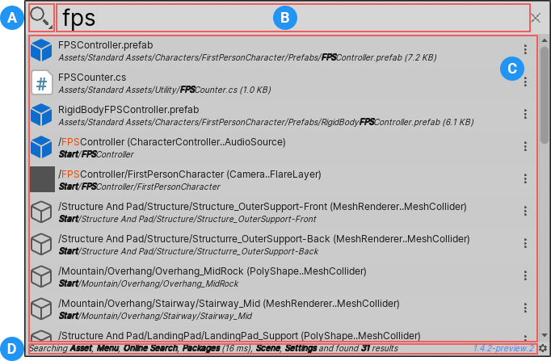
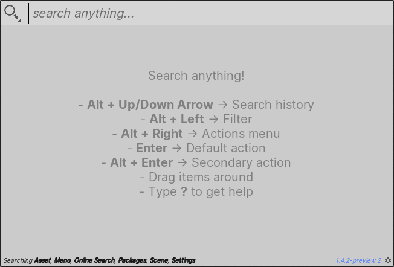
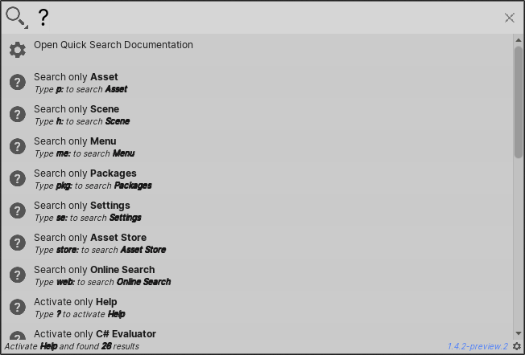
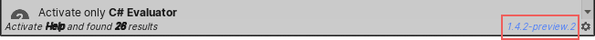

# Unity Quick Search

Use Quick Search to search sources inside and outside of Unity, and perform actions on the results.

For example, from the Quick Search window you can find Assets and open them, find Unity packages and install them, or find menu commands and run them.

A specific _[Search Provider](#search-providers)_ defines the sources, possible results, and available actions for each type of search.

## The Quick Search window

To launch Quick Search use the **Alt + '** shortcut or the menu (**Help > Quick Search**).

||||
|-|-|-|
|**A**|Filters icon   | Opens the [Filters pane](search-filters.md#persistent-search-filters), where you can toggle Search Providers on and off.   |
|**B**   | Search field  | Enter your search query here.  For details about all the ways you can search Unity with Quick Search, see [Using Quick Search](usage.md). |
|**C**  | Results area  | Displays search results as you type the search query.  Items that best match the search query appear higher in the results. Quick search also learns over time, and prioritizes items that you select often. See [Settings](settings.md) to learn how to customize search result ordering.|
|**D**  | Status bar  | Displays detailed information about the last search, including which Search Providers it used, how many results it returned, and how long it took to execute.   |

## Search Providers

Each type of search has its own Search Provider. A Search Provider indexes part of Unity or connects to external resources, and defines the actions you can perform on items that Quick Search returns.

There are two types of Search Provider:

- [Regular Search Providers](regular-searches.md) are opt-out. When you perform a regular search, Quick Search uses all regular Search Providers, unless you exclude them.
- [Special Search Providers](special-searches.md) are opt-in. You must explicitly tell Quick Search to perform a special search. You can only use one special Search Provider at a time.

You can also [create your own Search Providers](api.md).

Each Search Provider has a unique [search token](search-filters.md#search-tokens). A search token is a text string that you can use in the search field to search using only a specific Search Provider.

## Getting help

You can get help with Quick Search in the following ways:

- When you first launch the Quick Search window, the results area displays the basic keyboard shortcuts.    
- Type **?** (question mark) in the search field to display a quick reference for different types of searches.    
- Select the version number in the status bar to open the Quick Search documentation.  
