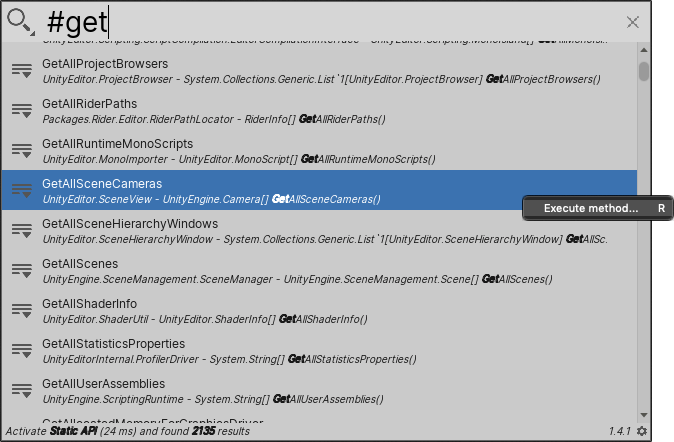

# Executing API methods

The Static API Search Provider indexes all of Unity's parameterless public static API methods and properties, and makes them available to execute.

[!include]

**[Search token](search-filters.md#search-tokens):**  `#` (hash symbol)

**[Default action](usage.md#default-actions):** Executes the API method.

**[Context menu actions](usage.md#additional-actions):**

|Action:|Function:|
|-|-|
| **Execute method**  | Executes the API method.  |

 _Static API Search Provider_