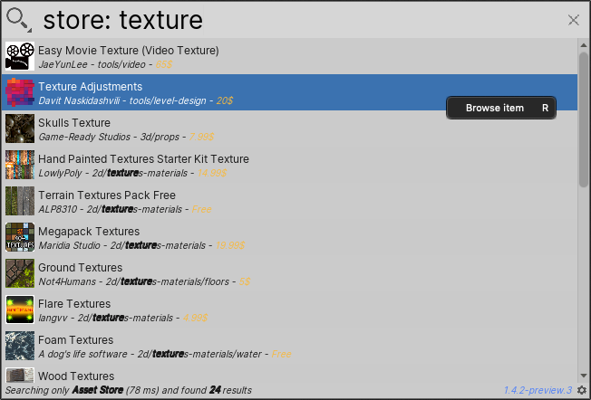

# Searching the Unity Asset Store

The Asset Store Search Provider searches the [Unity Asset Store](https://assetstore.unity.com/). Each item in the results displays information about an Asset, such as its name, price, publisher, and category.

**[Search token](search-filters.md#search-tokens):**  `store:`

**[Default action](usage.md#default-actions):** Opens the Unity Asset Store web site to the Asset's page.

**[Context menu actions](usage.md#additional-actions):**

|Action:|Function:|
|-|-|
| **Browse item**  | Opens the Unity Asset Store web site to the Asset's page.  |

 _Asset Store Search Provider_

