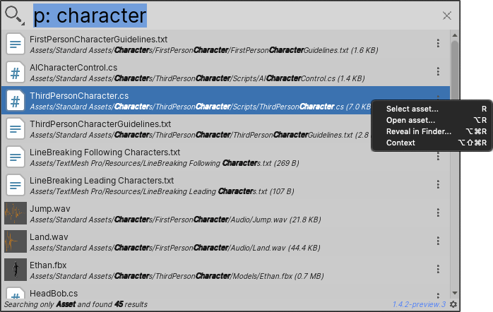
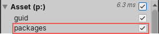

# Searching Project Assets

Use the Asset Search Provider to search all Assets in the current Project. You can search using keywords or GUIDs (Instance IDs).

You can also search the [Asset Database](#asset-search-provider-vs-asset-database-search) or the [file system](#searching-the-file-system) from the Quick Search window.

**[Search token](search-filters.md#search-tokens):**  `p:` (for "project")

**[Default action](usage.md#default-actions):** Open the Asset, either in Unity or in an external editor.

**[Context menu actions](usage.md#additional-actions):**

|Action:|Function:|
|-|-|
| **Select asset**  | Selects the Asset in the Project window.  |
| **Open asset**  | Opens the Asset, either in Unity or in an external editor.  |
| **Show in Explorer/Finder**  | Selects the Asset in the operating system's file browser.  |
| **Context**  | Displays the Asset's regular context menu.  |

 _Asset Search Provider_

## Excluding packages from asset searches

By default, the Asset Search Provider finds installed packages. To exclude them from the results, toggle them off them in the [Filters pane](search-filters.md#persistent-search-filters).

 _The package toggle for Asset searches_

## Asset Search Provider vs. Asset Database search

Quick Search uses its own Asset indexer, which is faster and more flexible than the Asset Database or the Project Browser.

For example:
- You can type a file extension and it will find all Assets with that extension.
- It matches against directory name
- It does partial search

Unlike the Asset Database, the Asset Search Provider doesn't recognize type or label, but you can perform an Asset Database search from the Quick Search window.

### Using the Asset Database search in Quick Search

To bypass the Quick Search Asset indexer and use the Asset Database search, add Asset Database search tokens to your search query.

For example, use `t:Scripts` to find script type Assets, or `l:Terrain` to find Assets labeled "Terrain".

When you use Asset Database search tokens, Quick Search uses auto completion to suggest a filter.

## Searching the file system

If you use the asterisk (**&#42;**) in a query, Quick Search performs both a normal search and a wildcard search against the file systems. This allows you to include files not indexed by the Asset database in your searches.

