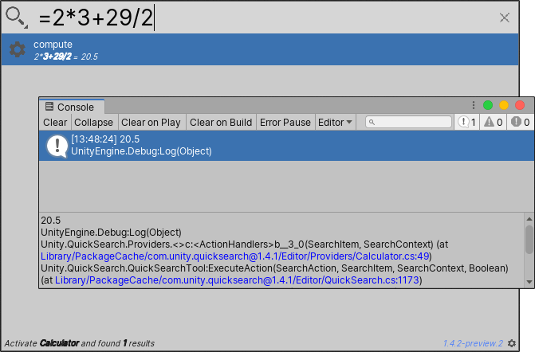

# Using the calculator

The Calculator Search Provider computes expressions directly in Quick Search. Enter any expression that is valid in a numerical text field in Unity, and Quick Search displays the result in the results area.

[!include]

**[Search token](search-filters.md#search-tokens):**  `=` (equals sign)

**[Default action](usage.md#default-actions):** Logs the result of the expression to the console, and copies it to the clipboard.

**[Context menu actions](usage.md#additional-actions):**

|Action:|Function:|
|-|-|
| **Compute**  | Logs the result of the expression to the console, and copies it to the clipboard.  |

 _Calculator Search Provider_
