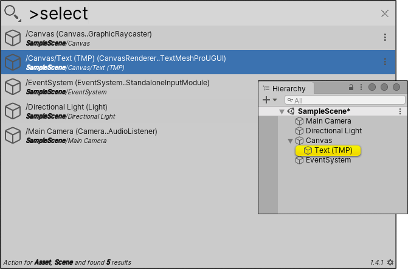

# Command queries

Command queries are a kind of reverse search. You enter commands in the search field, and Quick Search returns items that support those commands.

For example, the search query `>select text` returns a list of GameObjects in the current Scene that you can select, and that match the search term "text".

[!include]

**[Search token](search-filters.md#search-tokens):**  `>` (right angle bracket)

**[Default action](usage.md#default-actions):** Executes the command on the selected item.

**[Context menu actions](usage.md#additional-actions):** These vary depending on the command you use, and the type of item Quick Search returns.

## Command query commands

You can use the following query commands in Quick Search:

|Command:|Returns:|
|-|-|
|`select`  | GameObjects that you can select, or highlight in the Hierarchy window.  |
|`open`   | Assets that you can open in an Editor window.  |
|`reveal`   | Assets that you can highlight in the Project window.  |
|`context`   |A list of Assets and/or GameObjects. You can open any item's normal context menu.   |
|`exec`   | Executes a command or computation  |
|`help`   | Quick Search help in the results area.  |
|`copy`   | Console log entries that you can copy to the clipboard. |
|`browse`   | Available resources for an [Online search](search-online.md).  |
|`install`   | Packages that you can install (the same way you would using the install option in the [Package search](search-packages.md)).  |
|`remove`   | Packages that you can uninstall (the same way you would using the remove option in the [Package search](search-packages.md)). |

 _Command query Search Provider_