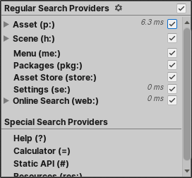

# Filtering searches

Filtering narrows the scope of your searches to specific providers. You can filter searches in the following ways:

- Set up persistent search filters to control which providers Quick Search uses for regular searches.

- Use a regular or special Search Provider's _search token_ in the search field to only display results from that provider.

## Persistent search filters

You can temporarily toggle Search Providers on and off from the Filters pane. This can help reduce the number of items that a search returns, which is convenient if you already know what type of item you are looking for. The providers that are toggled on at any given time are the _active_ Search Providers.

 _The Filters pane_

When you toggle Search Providers off in the Filters pane, Quick Search "mutes" them rather than disabling them completely. Search Providers that perform background indexing or other hidden operations continue to do so when muted.

> [!NOTE]
> To permanently toggle Search Providers on and off, use the [Quick Search preferences](settings.md).

To set persistent search filters:

1. Launch Quick Search and do one of the following to open the Filters pane:
  - Select **filters** (magnifying glass icon).
  - Use **Alt + &larr;** (left arrow).
1. Disable any Search Providers you want to exclude from subsequent searches.

> [!TIP]
> You can use  **&uarr;** (up arrow) and **&darr;** (down arrow) to cycle through the available filters, and **Space** to toggle a filter.

## Search tokens

Every Search Provider has a unique text string called a _search token_, also called a _filter ID_. When you prefix a search query with a provider's search token, Quick Search limits the scope of the search to that provider.

For example, `p:` is the search token for the Asset Search Provider. When you enter `p:Player` in the search field, Quick search searches for Assets that match the term "Player" (for example, assets with "Player" in their names).

See [Regular searches](regular-searches.md) for a list of search tokens for regular Search Providers.

See [Special searches](special-searches.md) for a list of search tokens for special Search Providers.

