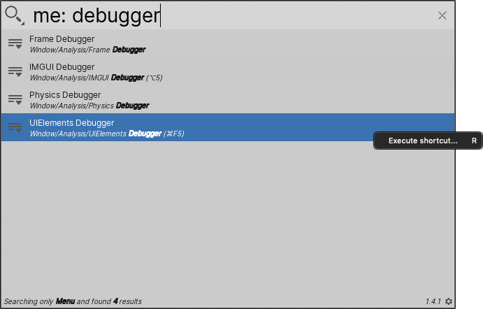

# Searching the Unity main menu

Use the Menu Search Provider to quickly locate commands in the Unity Editor main menu.

**[Search token](search-filters.md#search-tokens):** `me:`

**[Default action](usage.md#default-actions):** Executes the menu command.

**[Context menu actions](usage.md#additional-actions):**

|Action:|Function:|
|-|-|
|**Execute shortcut**   | Executes the menu command.  |

 _Menu Search Provider_