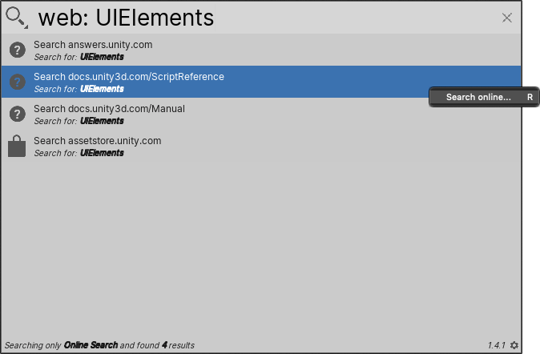
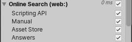

# Searching online resources

Use the Online Search Provider to search the following Unity web sites:

Unity documentation:
- [User Manual](https://docs.unity3d.com/Manual/)
- [Scripting Reference](https://docs.unity3d.com/ScriptReference/index.html)

Other Unity online resources:
- [Asset Store](https://assetstore.unity.com)
- [Unity Answers](https://answers.unity.com/)

You can [exclude](#excluding-online-sources) any of these sites from the results.

**[Search token](search-filters.md#search-tokens):** `web:`

**[Default action](usage.md#default-actions):** Opens your default web browser to the selected source, and searches for the search query.

**[Context menu actions](usage.md#additional-actions):**

|Action:|Function:|
|-|-|
|**Search online**   | Opens your default web browser to the selected source, and searches for the search query.  |

> [!NOTE]
> You can add new online sources to search. To add an online source,  [create your own Web Search Provider](api.md).

 _Online Search Provider_

## Excluding online sources

To exclude a site from online search results, open the [Filters pane](search-filters.md#persistent-search-filters) and toggle it off.

 _Options in the Filters Pane to include and exclude sites from online searches_