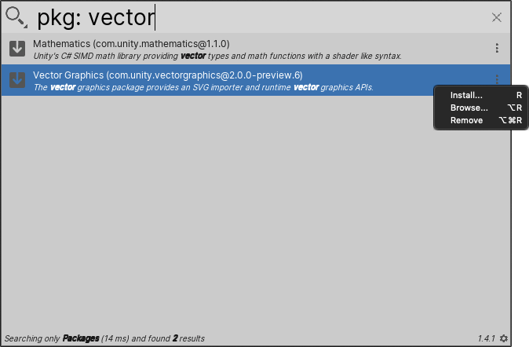

# Searching for packages

The Package Search Provider searches for installed and available Unity packages. You can install, update, or remove any package in the search results.

**[Search token](search-filters.md#search-tokens):** `pkg:`

**[Default action](usage.md#default-actions):** Install the package.

**[Context menu actions](usage.md#additional-actions):**

|Action:|Function:|
|-|-|
|**Install:**   |Prompts you to install the package.  |   
|**Browse:**   |Checks for package updates.   |   
|**Remove:**   |Uninstalls the package from the Project.   |   

 _Package Search Provider_