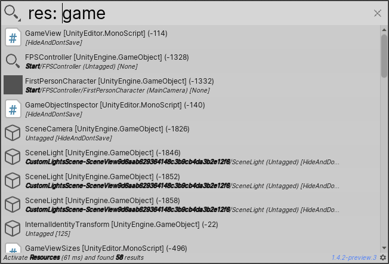
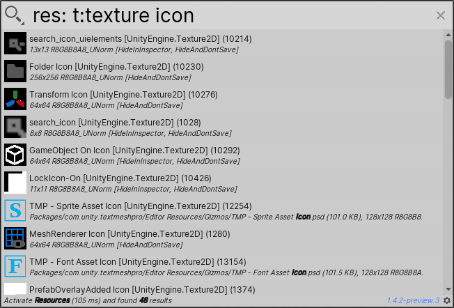
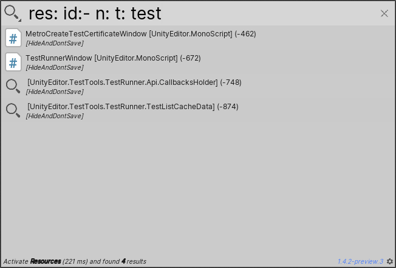

# Searching loaded resources

The Resource Search Provider searches all currently loaded resources, and returns those that match the search term in _any_ way.

For example, the search query `res: game` returns resources with "game" in their names, but it also returns all loaded GameObjects because the GameObject type matches the search term "game".

The Resource Search Provider also has [sub-filters](#sub-filters) that you can use to narrow the scope of your searches.

[!include]

**[Search token](search-filters.md#search-tokens):**  `res:`

**[Sub-filter](#sub-filters) tokens:**

- **Type**: `t:`
- **Name**: `n:`
- **ID**: `id:`
- **Tag**: `tag:`

**[Default action](usage.md#default-actions):** This varies, based on items returned.

**[Context menu actions](usage.md#additional-actions):** These vary, based on items returned.

 _Resource Search Provider_

## Sub-filters

Sub-filters allow you to search a subset of the Resource Search Provider results. Each sub-filter has its own search token. To apply the sub-filter, add the search token to the search query.

For example, to find all loaded Textures, you could use the search query `res: t: texture`. When you add `t:` to the query, the Resource Search Provider uses the **Type** sub-filter. The search term `texture` tells it to return only Texture resources.

#### Sub-filter examples

|Sub-filter:| Search  token:|Example:|
|-|-|-|
|**Type**   | `t:`  | `res: t: texture`  Searches all loaded resources, and returns Texture type resources only.  |
|**Name**   | `n:`  | `res: n: window`  Searches all loaded resources  and returns only the ones with "window" in their names.  |
|**ID**  | `id:`  | `res: id: -15`   Searches all loaded resources and returns the ones whose instance IDs begin with "-15".|
|**Tag**   | `tag:`  | `res: tag: environment`   Searches all loaded resources and returns the ones tagged "environment".  |

### Using sub-filters with keywords

You can add a keyword to a sub-filter to refine a search even further. You must add the keyword directly after the sub-filter search token, with no empty spaces in between.

For example, to find _icon_ Textures, you could use the search query `res: t:texture icon`. The `t:texture` sub-filter/keyword combination tells the Resource Search Provider to find loaded Texture resources first. It then searches those resources, and returns the ones that match the term "icon."

 _Resource Search Provider with Type sub-filter_

#### Sub-filter + keyword examples

|Sub-filter:| Search  token:|Function:|Example:|
|-|-|-|-|
|**Type**   | `t:`  |Searches items of a specific type.| `res: t:texture icon`  Searches all loaded Textures, and returns the ones that match the term "icon".  |
|**Name**   | `n:`  |Searches items with a specific name.| `res: n:window -10`  Searches all loaded resources with "window" in their names, and returns the ones that match the term "-10"  |
|**ID**  | `id:`  |Searches items with a specific Instance ID.| `res: id:-1 game`   Searches all loaded resources that have instance IDs that begin with "-1," and returns the ones that match the term "game."|
|**Tag**   | `tag:`  |Searches items with a specific tag.| `res: tag:Untagged ca`   Searches all loaded resources that have no tags, and returns the ones that match the search term "ca."  |

### Combining sub-filters

You can use multiple sub-filters in the same search query to perform complex searches that return very specific lists of resources.

For example, let's say you want to find a specific resource by keyword. You don't know if the keyword is in the name or the tag, but you know the resource has a negative instance ID.

In this case, you could use the search query `res: id:- n: t: KEYWORD`. First, it finds all loaded resources with a negative instance ID. Then it searches those resources, and returns the ones whose names or tags contain the keyword.  

 _Resource Search Provider with three sub-filters combined_
