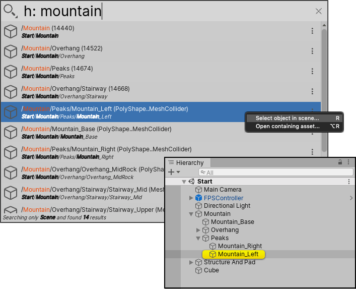
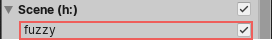

# Searching the current Scene

Use the Scene Search Provider to find GameObjects in the current Scene.

By default, Scene Search Provider uses a "fuzzy" search. Fuzzy searches are more resource intensive than direct searches, but usually return more matches. They can be slower in larger Scenes, so you might want to [disable them](#disabling-fuzzy-search) if you notice a lag.

**[Search token](search-filters.md#search-tokens):**  `h:` (for "hierarchy")

**[Default action](usage.md#default-actions):** Select the GameObject in the Scene.

**[Context menu actions](usage.md#additional-actions):**

|Action:| Function:|
|-|-|
|**Select object in scene**   | Selects the GameObject in the Scene and the Hierarchy window.   |
|**Open containing asset**   | Opens the Project Asset that contains the GameObject.  |

 _Scene Search Provider_

## Disabling fuzzy search

If you notice a lag in Scene searches, you can disable fuzzy searching from the [Filters pane](search-filters.md#persistent-search-filters).

 _The **fuzzy** search toggle for Scene searches_
