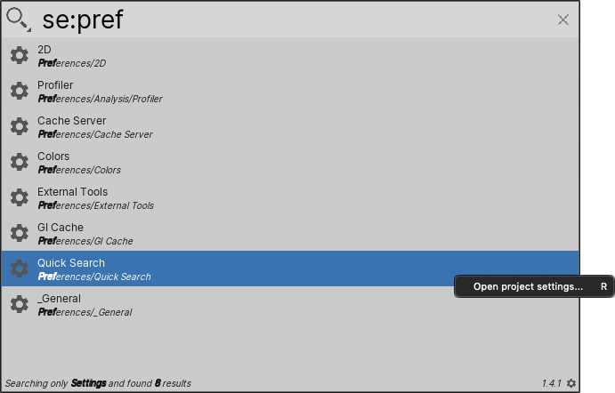

# Searching Settings and Preferences

Use the Settings Search Provider to search all of the settings in the [Project Settings](https://docs.unity3d.com/Manual/comp-ManagerGroup.html) and [Preferences](https://docs.unity3d.com/Manual/Preferences.html) windows. It returns all Settings and Preferences pages that match the search query.

**[Search token](search-filters.md#search-tokens):**  `se:`

**[Default action](usage.md#default-actions):** Opens the page in the Project Settings or Preferences window.

**[Context menu actions](usage.md#additional-actions):**

|Action:| Function:|
|-|-|
|**Open project settings page**   | Opens the page in the Project Settings or Preferences window.   |

 _Settings Search Provider_