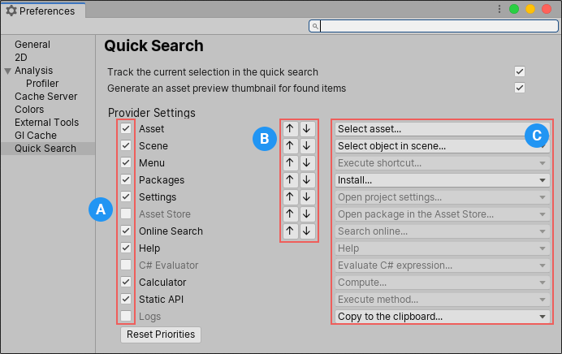

# Quick Search Preferences

You can set Quick Search preferences from the Unity [Preferences window](https://docs.unity3d.com/Manual/Preferences.html) (menu: **Unity > Preferences**).

> [!TIP]
> You can also access the Quick Search preferences in any of the following ways:
> - Enter **?** (question mark) in the search field and select **Open Quick Search Preferences** from the results.
> - In the [status bar](index.md#the-quick-search-window) or the [Filters pane](search-filters.md#persistent-search-filters), select **Preferences** (gear icon).  

 _Quick Search Settings_

|Setting:||Function:|
|-|-|-|
|**Track the current selection in the quick search**   |   |Enable this setting to execute the [`SearchProvider.trackSelection`](api.md#track-selection) callback each time the Quick Search selection changes.  The callback _pings_ Assets in the Project window or Hierarchy window, which can slow Quick Search navigation in large Projects.|
|**Generate an asset preview thumbnail for found items**   |   |Enable this setting to display thumbnails for items that are currently visible in the results pane of the Quick Search window.  When you disable this setting, Quick Search displays a generic icon. This is useful in large Projects, where generating icons can slow Quick Search navigation.|
|**Provider Settings**   |   |   |
|   | **A** _[Provider Toggles]_  | Enable and disable providers. When you disable a provider, Quick Search ignores it when executing searches.   |
|   | **B** _[Provider Order]_  | Use these settings to modify the order in which search items are shown on the screen. All items of a given priority appear before any lower priority items.  |
|   |  **C** _[Default Actions]_  | Use these settings to choose the default actions to execute when you select (for example, double-click) an item in the search results. |
|**Reset Priorities**   |   | Resets all providers to their default on/off state and priority.  |
