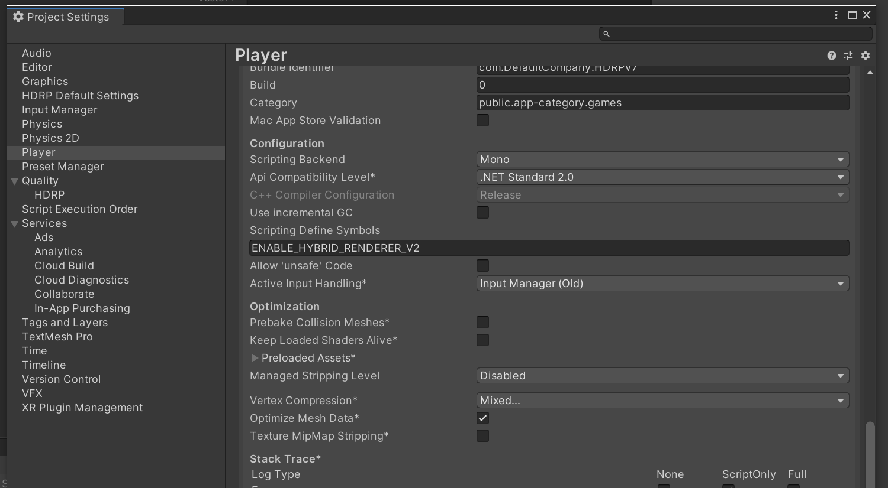
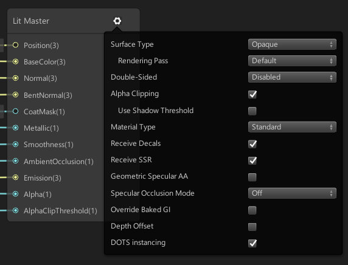
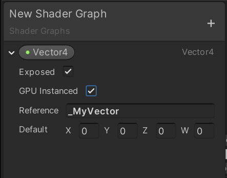

# DOTS Hybrid Renderer


The Hybrid Renderer package provides systems and components for rendering ECS entities using Unity's existing rendering architecture. 

Hybrid Renderer is not a render pipeline: it is a system that collects the ECS data needed to render the scene made from DOTS entities, and sends this data to Unity's existing rendering architecture. Using ECS entities instead of GameObjects results in significantly improved runtime memory layout and performance in large scenes, and using Unity's existing rendering architecture maintains the compatibility and ease of use of Unity's existing workflows.

This package contains two versions of Hybrid Renderer:

[Hybrid Renderer V1](#v1) is the existing DOTS hybrid rendering technology introduced in the Megacity project and released in 2019.1. It is no longer in active development.

[Hybrid Renderer V2](#v2) is the improved hybrid rendering technology introduced in Unity 2020.1, which provides better performance and an improved feature set. It is in active development.

## Render pipeline compatibility

Hybrid Renderer V1 is compatible with the Built-in Render Pipeline in Unity 2019.1 and above, the High Definition Render Pipeline (HDRP) in Unity 2019.1 and above, and the the Universal Render Pipeline (URP) in Unity 2020.1 and above. The supported feature set for all of these render pipelines is limited.

Hybrid Renderer V2 is compatible with Unity 2020.1 and above, HDRP version 9.0.0-preview and above, and URP version 9.0.0-preview and above. Hybrid Renderer V2 is early in development and some features are not yet supported, but we aim to support the full feature set.

## Enabling Hybrid Renderer

When the Hybrid Renderer package is installed in your Project, Hybrid Renderer V1 is enabled by default.

To use Hybrid Renderer V2 you need to have Unity 2020.1.0b3 or later, and version 9.0.0-preview or above of the HDRP or URP package. To enable Hybrid Renderer V2, add the **ENABLE_HYBRID_RENDERER_V2** define to your Project's Scripting Define symbols:


When Hybrid Renderer V2 is active, Unity displays the following message in the Console window:

```
Hybrid Renderer V2 active, MaterialProperty component type count X / Y
```

## Hybrid Renderer overview

### Runtime functionality

At runtime, Hybrid Renderer processes all entities that have the following DOTS components: LocalToWorld, RenderMesh and RenderBounds. It automatically adds other components required for rendering to these entities. These processed entities are added to batches, and batches are rendered using existing Unity rendering architecture.

To add entities to your Scene at runtime, it is better to instantiate Prefabs rather than to create new entities from scratch. Prefabs are already converted to optimal data layout during DOTS conversion, which results in improved performance.

### The GameObject conversion system

This package includes GameObject conversion systems that convert various GameObjects into equivalent DOTS entities.

To convert your GameObjects to DOTS entities, you can either put them into a SubScene or add ConvertToEntity component on them. SubScenes are converted in the Unity Editor and stored to disk. ConvertToEntity results in runtime conversion. Conversion in Unity Editor results in significantly better scene loading performance.

**Conversion process:**

* The conversion system converts [MeshRenderer](https://docs.unity3d.com/Manual/class-MeshRenderer.html) and [MeshFilter](https://docs.unity3d.com/Manual/class-MeshFilter.html) components into a DOTS RenderMesh component on the entity. Depending on the render pipeline your Project uses, the conversion system might also add other rendering-related components.
* The conversion system converts [LODGroup](https://docs.unity3d.com/Manual/class-LODGroup.html) components in GameObject hierarchies to DOTS MeshLODGroupComponents. Each entity referred by the LODGroup component has a DOTS MeshLODComponent.
* The conversion system converts the Transform of each GameObject into a DOTS LocalToWorld component on the entity. Depending on the Transform's properties, the conversion system might also add DOTS Translation, Rotation, and NonUniformScale components.

<a name="v1"></a>

## Hybrid Renderer V1

Hybrid Renderer V1 is the existing DOTS hybrid rendering technology introduced in the Megacity project and released in 2019.1. It supports a very limited feature set. It is no longer in active development.

**Features not supported:**
* Motion blur (motion vectors missing)
* Temporal antialiasing (motion vectors missing)
* LOD Fade
* Lightmaps
* RenderLayer (layered lighting)
* TransformParams (correct lighting for inverse scale)

**Additional features not supported in URP:**
* Point lights and spot lights
* Light probes
* Reflection probes

### Setting up shaders for Hybrid Renderer V1

Hybrid Renderer V1 only supports ShaderGraph based shaders. Built-in shaders such as HDRP/Lit are not supported.

**How to set up shaders and material for Hybrid Renderer V1:**

Enable **Enable GPU Instancing** on every material used with Hybrid Renderer:


Unity 2019.1: Enable **DOTS Instancing** checkbox in ShaderGraph HDRP/Lit master node (cog menu):


Unity 2019.2: Enable **GPU Instanced** checkbox in any ShaderGraph custom property:


Unity 2019.3+: Enable **Hybrid Instanced (experimental)** checkbox in any ShaderGraph custom property:


Unless every shader and material you use with Hybrid Renderer V1 is setup correctly, you might encounter visual issues. Unfortunately, there's no validation or error messages in Hybrid Renderer V1. The most common visual issues caused by incorrect Shader and Material setup are:

* All entities rendering at position (0,0,0) in standalone builds
* Flickering or incorrect colors, especially on DX12, Vulkan and Metal backends
* Flickering/stretching polygons, especially on DX12, Vulkan and Metal backends 

**IMPORTANT:** Unity 2020.1 and SRP 8.0.0 added official Hybrid Renderer V1 support for Universal Render Pipeline (URP). If you are using Hybrid Renderer V1 with URP with an older Unity version, you might see similar graphics issues as described above. 

<a name="v2"></a>

## Hybrid Renderer V2

Hybrid Renderer V2 is the new improved hybrid rendering technology introduced in Unity 2020.1. This technology provides both better performance and an improved feature set. It is in active development.

Hybrid Renderer V2 has a new GPU-persistent data model with delta update to GPU memory directly from Burst C# jobs. The main thread bottleneck of Hybrid Renderer V1 is gone, and render thread performance is also improved. The new data model allows us to feed the shader built-in data from C#, allowing us to implement missing HDRP and URP features. 

Hybrid Renderer V2 is compatible with following shader types: ShaderGraph, HDRP/Lit, HDRP/Unlit, URP/Lit, URP/Unlit. We will add support for more shader types in future releases.

**New features in 2020.1 + hybrid.renderer 0.3.6:**
* Official URP support (minimal feature set)
* Support for non-ShaderGraph shaders
* Motion blur (motion vectors)
* Temporal antialiasing (motion vectors)
* RenderLayer (layered lighting)
* TransformParams (correct lighting for inverse scale)
* Hybrid Entities: Subscene support for Light, Camera and other managed components
* DisableRendering component (disable rendering of an entity)

**IMPORTANT:** Hybrid Renderer V2 is experimental in Unity 2020.1. We have validated it on Windows DX11, Vulkan and Mac Metal backends in both Editor and Standalone builds. Our aim is to validate DX12, mobile device and console platform support for 2020.2.

### HDRP & URP material property overrides

Hybrid Renderer V2 supports per-entity override of various HDRP and URP material properties. We have a built-in library of IComponentData components you can add to your entities to override their material properties. You can also write C#/Burst code to setup and animate material override values at runtime.

**Supported HDRP Material Property overrides:**
* AlphaCutoff
* AORemapMax
* AORemapMin
* BaseColor
* DetailAlbedoScale
* DetailNormalScale
* DetailSmoothnessScale
* DiffusionProfileHash
* EmissiveColor
* Metallic
* Smoothness
* SmoothnessRemapMax
* SmoothnessRemapMin
* SpecularColor
* Thickness
* ThicknessRemap
* UnlitColor (HDRP/Unlit)

**Supported URP Material Property overrides:**
* BaseColor
* BumpScale
* Cutoff
* EmissionColor
* Metallic
* OcclusionStrength
* Smoothness
* SpecColor

If you want to override a built-in HDRP or URP property not listed here, you can do that with custom ShaderGraph material property overrides.

### Custom ShaderGraph material property overrides

You can create your own custom ShaderGraph properties, and expose them to DOTS as IComponentData. This allows you to write C#/Burst code to setup and animate your own shader inputs.

Enable **Hybrid Instanced (experimental)** checkbox in your ShaderGraph custom property:


Then write a DOTS IComponentData struct:

```C#
[MaterialProperty("_Color", MaterialPropertyFormat.Float4)]
public struct MyOwnColor : IComponentData
{
    public float4 Value;
}
```

Ensure that the *Reference* name in ShaderGraph and the string name in MaterialProperty attribute match exactly. The type declared in the MaterialPropertyFormat should also be compatible with both the ShaderGraph and the struct data layout. If the binary size doesn't match, you will see an error message in the console window.

Now you can write Burst C# system to animate your material property:

```C#
class AnimateMyOwnColorSystem : SystemBase
{
    protected override void OnUpdate()
    {
        Entities.ForEach((ref MyOwnColor color, in MyAnimationTime t) =>
            {
                color.Value = new float4(
                    math.cos(t.Value + 1.0f), 
                    math.cos(t.Value + 2.0f), 
                    math.cos(t.Value + 3.0f), 
                    1.0f);
            })
            .Schedule();
    }
}
```

**IMPORTANT:** You need to create a matching IComponentData struct (described above) for EVERY custom ShaderGraph property having **Hybrid Instanced (experimental)** checkbox set. If you fail to do so, Hybrid Renderer will not fill these properties: Hybrid Renderer V1 leaves the data uninitialized (flickering). Hybrid Renderer V2 zero fills the data.

## Sample projects

Hybrid Renderer sample projects can be found at:
* **HDRP:** HybridHDRPSamples directory
* **URP:** HybridURPSamples directory

Project folder structure:
* **SampleScenes:** Contains all sample scenes, showcasing the supported features.
* **StressTestScenes:** Contains stress test scenes for benchmarking. 
* **Tests:** Graphics tests (for image comparisons).

Sample projects are using Hybrid Renderer V2 and require Unity 2020.1.0b3 or later and version 9.0.0-preview of the HDRP and URP packages.
