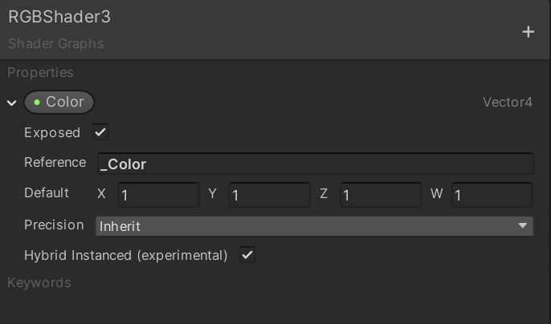
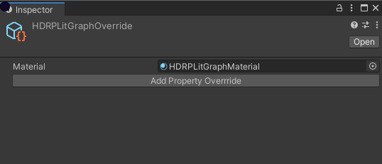
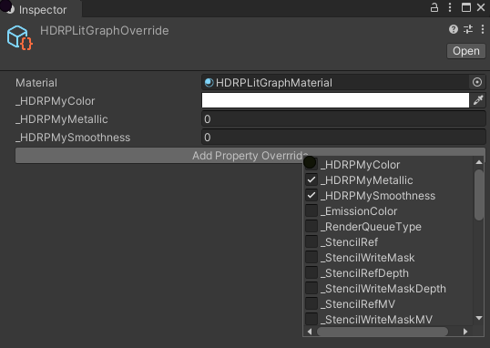
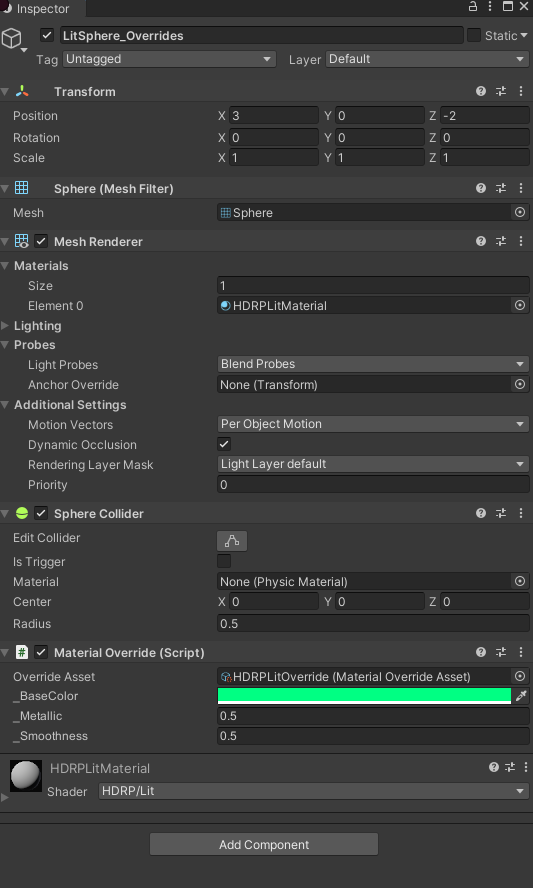
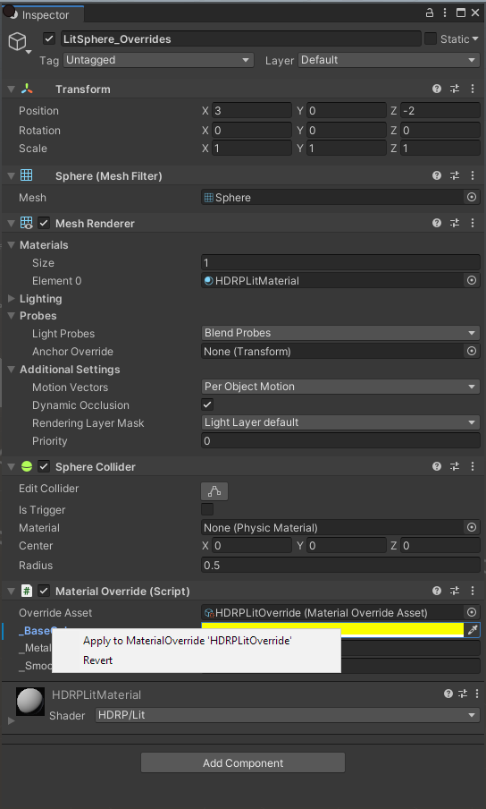

# Material Overrides

This guide is meant to show you how to setup overrides on a material's properties without having to write code. This is meant to work in Hybrid Renderer V2.

## Sample Scenes
* **HDRP:** HybridHDRPSamples -> SampleScenes -> MaterialOverridesSample
* **URP:** HybridURPSamples -> SampleScenes -> MaterialOverridesSample

## Setting Up Material Overrides
1. Create a material if one isn't already created and check **Enable GPU Instancing** on it.

2. If material is using a Shader Graph shader, make sure properties you wish to override have **Exposed** and **Hybrid Instanced (experimental)** enabled. **NOTE:** Only Vector1, Vector4, and Color types are currently supported for overrides.

3. Right click inside a directory in the **Project** window and go to **Create** -> **Shader** -> **Material Override Asset**
4. With the new Material Override Asset selected, in the **Inspector**, add your material to the **Material** field.

5. Click **Add Property Override** and select the properties you wish to override with this asset. **NOTE:** If using custom properties from a Shader Graph based material, you will likely have to wait for an Asset Data Refresh and Import to happen after you've selected your properties. You will notice a C# script file was created next to your material in your project. Do not touch this file.

6. Modify the properties on the asset however you wish.
7. Select a GameObject with a matching material. In the **Inspector** click **Add Component** and select **Material Override**
8. For that component, add your new Material Override Asset to the **Override Asset** field.

9. You can add this asset to all GameObjects you wish to give this set of overrides. Editing the material properties from the Inspector while the Material Override Asset is selected will update all the corresponding GameObjects.
10. You can also edit the properties on a GameObject's **Material Override** component as well to only affect that instance. When doing this you will note that the margin will turn blue and the property text bold. This means you have overriden the defaults of the Material Override Asset.
11. You can either push the instance's setting to the asset to update all other GameObjects or reset it to the asset's default by right clicking on the property. GameObjects that also override the asset's default will not be affected.

12. You can create more Material Override Assets for the same material with the same or different set of properties and then modify those properties per GameObject as well. It will not interfere with other Material Override Assets.
